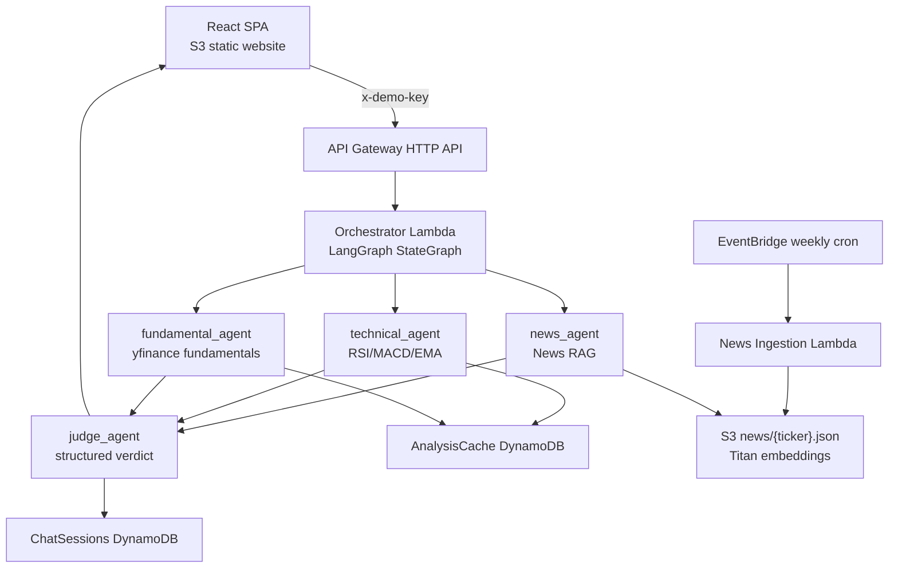

# AI Swing Trade Assistant

Portfolio/demo multi-agent serverless RAG app for Nifty 50 swing-trade queries.
A React SPA calls an API Gateway → Orchestrator Lambda that runs a **LangGraph**
state machine: News, Technical, and Fundamental specialist agents fan out in
parallel, then a Judge agent synthesizes a structured BUY/SELL/HOLD verdict.
Weekly EventBridge job embeds ticker news into S3 for hand-rolled RAG.

> Not production auth. The login screen is cosmetic; the only real gate is a shared
> `x-demo-key` header protecting Bedrock spend on a public resume demo link.

## Architecture



## Repo layout

```text
backend/     Serverless Framework (Python 3.11 arm64 Lambdas)
frontend/    React + Vite + Tailwind SPA
scripts/     Deploy-profile helpers (SSM → local AWS CLI profile)
```

## Prerequisites

- Node.js 18+
- Python 3.11+ (local testing only)
- AWS CLI + Serverless Framework v3
- Bedrock model access in `us-east-1` for:
  - `anthropic.claude-3-haiku-20240307-v1:0`
  - `anthropic.claude-3-5-sonnet-20240620-v1:0`
  - `amazon.titan-embed-text-v2:0`
- SSM parameters (SecureString):
  - `/IAM_ACCESS_KEY` and `/IAM_SECRET_ACCESS` — **deploy-time IAM user only**
  - `/DEMO_API_KEY` — shared secret checked by the orchestrator

## 1. Configure deploy credentials from SSM

Do **not** put these keys in Lambda environment variables. They configure a local CLI profile:

```powershell
# PowerShell
.\scripts\setup-deploy-profile.ps1
```

```bash
# bash
chmod +x scripts/setup-deploy-profile.sh
./scripts/setup-deploy-profile.sh
```

## 2. Deploy backend

```bash
cd backend
npm install
copy .env.example .env   # set DEMO_API_KEY (or rely on SSM /DEMO_API_KEY)
# Windows PowerShell:
$env:AWS_PROFILE="swingtrade-deploy"
$env:DEMO_API_KEY="your-shared-secret"
npm run deploy
```

Note the outputs: `HttpApiUrl`, `FrontendBucketName`, `FrontendWebsiteUrl`.

Optional: run a one-off news ingest for a few tickers before Sunday cron:

```bash
npx serverless invoke -f ingestNews -d "{\"tickers\":[\"TCS.NS\",\"RELIANCE.NS\",\"INFY.NS\",\"HDFCBANK.NS\",\"SBIN.NS\"]}"
```

## 3. Deploy frontend

```bash
cd frontend
npm install
copy .env.example .env
# Set VITE_BACKEND_URL to HttpApiUrl (no trailing slash)
# Set VITE_DEMO_API_KEY to the same shared secret
npm run build

# Upload dist/ to the FrontendBucket from stack outputs
aws s3 sync dist/ s3://FRONTEND_BUCKET_NAME/ --delete --profile swingtrade-deploy
```

Open the `FrontendWebsiteUrl` (HTTP S3 website endpoint). Add CloudFront later only if you need HTTPS/custom domain.

## Local e2e (already deployed)

Backend is live in `us-east-1`. Point the Vite app at the **Function URL** (supports >30s; HTTP API may time out):

```text
Function URL: https://qbu4ie2nmpgblejrjaydw7rlkq0csvgi.lambda-url.us-east-1.on.aws
HTTP API:     https://1t7speb8r7.execute-api.us-east-1.amazonaws.com
```

```powershell
cd frontend
# .env already wired to Function URL + SSM /DEMO_API_KEY
npm install
npm run dev
```

Open http://127.0.0.1:5173 — cosmetic login accepts any email/password; API auth is the `x-demo-key` header only.

### Bedrock models on this account

Claude Haiku/Sonnet Marketplace access hits `INVALID_PAYMENT_INSTRUMENT` here, so the deploy uses:

- Specialists → `amazon.nova-micro-v1:0`
- Judge → `amazon.nova-pro-v1:0`
- Embeddings → `amazon.titan-embed-text-v2:0`

After adding a payment method in AWS Marketplace / Bedrock model access, you can switch env vars back to Claude IDs in `backend/serverless.yml`.

## API contract

`POST /analyze` — header `x-demo-key: <secret>`

```json
{ "query": "Should I buy TCS for next 3 months?", "ticker": "TCS" }
```

`GET /history` — same header; returns recent `ChatSessions` for the demo user.

## Cost / scale notes

Kept cheap on purpose: HTTP API, on-demand DynamoDB, arm64 Lambdas, no NAT, no CloudFront, no Cognito, no managed vector DB. Haiku for specialists, Sonnet only for the Judge. Shared-secret header gates the public demo.

**If this ever needs real traffic, add back in this order:** Step Functions (durable orchestration) → Cognito (real users) → managed vector store / Bedrock Knowledge Bases.

## LangGraph orchestration

The analyze path is a compiled `StateGraph` in `backend/shared/analysis_graph.py`:

1. `START` fans out to `news_agent` ∥ `technical_agent` ∥ `fundamental_agent` (each invokes its specialist Lambda).
2. All three fan in to `judge_agent`, which returns the structured verdict.
3. Orchestrator persists the result to `ChatSessions` and returns it to the UI.

## yfinance fragility

Yahoo rate-limits under bursty access. Mitigations baked in: DynamoDB analysis cache (24h technical / 7d fundamental), sequential weekly ingest with delay, retry/backoff, stale-cache fallback.

## Legacy cleanup

If you still see local `server/` or `ui/` folders, they are leftovers from the old FastAPI/JWT prototype (locked by `venv` / `node_modules`). Close any terminals using them, then delete those directories — the active code lives in `backend/` and `frontend/`.
